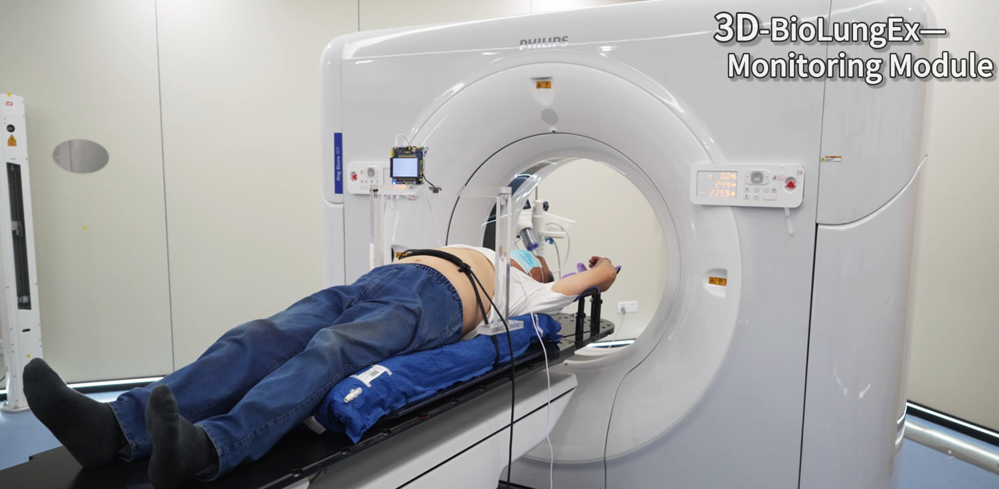
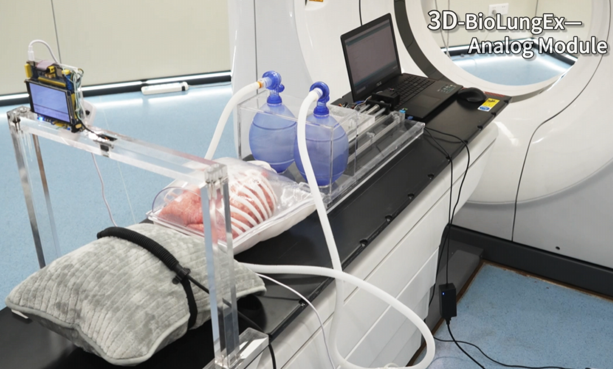
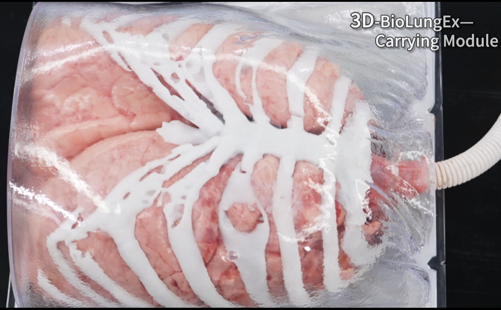
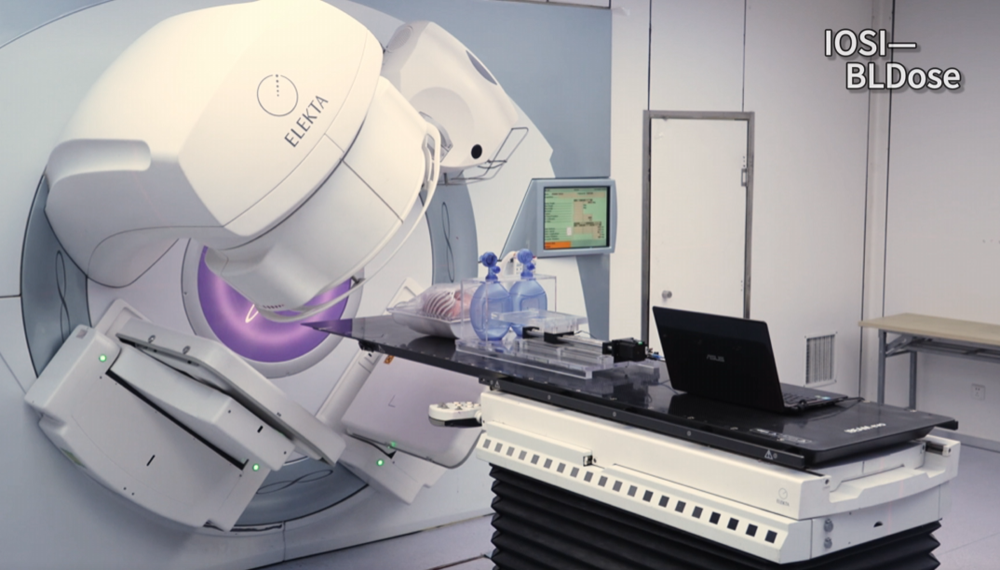

# Project Summary

This project focuses on the development of a novel hardware system and software algorithm for radiotherapy, with the goal of advancing radiotherapy techniques and exploring new technological possibilities.

## Hardware System:

A three-dimensional biological ex vivo motion simulation device (3D-BioLungEx) was designed to simulate human lung respiration. The 3D-BioLungEx comprises a monitoring module, a carrying module and an analog module, both of which have publicly available source codes.

## Software Algorithm:

The project also developed the IOSI-BLDose, a novel algorithm based on iterative optimization and scatter inversion, to calculate the three-dimensional dose distribution within biological tissue during radiotherapy. The source code for this algorithm is also publicly available.

Video:
https://github.com/NMUZYT/3D-BioLungEx-IOSI-BLDose/blob/main/demonstration%20of%203D-BioLungEx%20and%20IOSI-BLDose.mp4
